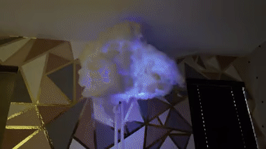

# Cloud LED (or any WS2812B LED Strip) Websocket Controller



Raspberry Pi Websocket controller for WS2812b LED strip. Used for a light up cloud build, hence the name, but will work anything using that LED strip

* [cloud-leds](https://github.com/drakeapps/cloud-leds) - for solid color and off modes
* [audio-reactive-led-strip](https://github.com/drakeapps/audio-reactive-led-strip) - for sound mode

Been tested on Model B+ and 4B, but has targets for all and _should_ work on any.

## Hardware

### Parts

* Raspberry Pi
* WS2812B LED Strip
* Level Shifter
* Additional 5V Power Supply (if needed)

### Build

Follow the [Adafruit guide](https://learn.adafruit.com/neopixels-on-raspberry-pi/raspberry-pi-wiring) on wiring NeoPixels. I used a level shifting chip with no issues. For my 250 LED setup, I have decently large 5V power supply in addition to the RPi 4 supply, and it has trouble powering all LEDs at higher brightness. This is why the default max brightness of the solid color mode is 25%.

## Installation

### Docker

On a Raspberry Pi with docker and docker-compose installed.

```bash
git clone https://github.com/drakeapps/cloud-led-controller
cd cloud-led-controller
cp .env-sample .env ;# edit as needed
make rpi ;# change based on your version: rpi|rpi2|rpi3|rpi4|rpi4-64
docker-compose up -d server
```

If you're wanting to be able to still play sound from the pi, the docker version will not work. It will take over control of `/dev/snd`

### Not Docker

From a clean Rasberry Pi OS install

```bash
sudo apt-get update && apt-get install -y \
	python3 python3-pip python3-dev python3-setuptools build-essential git python3-pyaudio python3-numpy python3-scipy python3-venv
sudo cp build/asound.conf /etc/asound.conf
sudo sed -i "s|defaults.ctl.card 0|defaults.ctl.card 1|g" /usr/share/alsa/alsa.conf
sudo sed -i "s|defaults.pcm.card 0|defaults.pcm.card 1|g" /usr/share/alsa/alsa.conf
# uncomment next two lines if wanting to use venv 
# python3 -m venv venv
# source venv/bin/activate
sudo pip3 install -r requirements.txt
sudo python3 server.py ;# plus whatever command line options
```

## Configuration

[List of the command line options](https://github.com/drakeapps/cloud-led-controller/blob/master/main.py#L62)

The important one is `n_pixels` representing the length of LED strip. This needs to be an even number even if you have an odd number of LEDs. Most of these options are passed to the respective [audio](https://github.com/drakeapps/audio-reactive-led-strip) or [solid](https://github.com/drakeapps/cloud-leds) led classes.

If using docker, edit the `.env` file to match these options, but in uppercase as shown  in [`.env-sample`](https://github.com/drakeapps/cloud-led-controller/blob/master/.env-sample)

## SSL

The Websocket server was not written to support SSL. In order to use SSL, we place an nginx reverse proxy in front of it. 

Place your `fullchain.pem` and `privkey.pem` in `/var/opt/ssl` or whatever mount point you put in `docker-compose.yml`

Start the docker container:

```bash
docker-compose up -d ssl
```

Browsers and SSL websockets are very picky. I highly recommend using a legit SSL cert (like letsencrypt) on a valid domain. I use [this gist](https://gist.github.com/drakeapps/f1272d1b9e2ace33246ae9fa712ca14f) to get a wildcard cert on my cloudflare managed DNS.

## Web UI

Included is a small react web interface. This doesn't need to be run on the same device as the websocket server.

Visit `ip-address/config` first to setup the websocket server location, port, and ssl.

### Building/Running

**Docker**

```bash
docker-compose up -d webui
```

**Building**

```bash
cd web-ui
npm i
npm run build
```

This builds the html and js files. You'll then need to serve them via your preferred web server.

A simple, yet insecure, way to serve the files is with [http-server](https://github.com/http-party/http-server)

```bash
npx http-server dist --proxy http://localhost:8080\?
```

## Homekit / Homebridge

### MQTT

MQTT is well supported in the Homebridge world. Rather than write my own websocket plugin, a Websocket/MQTT wrapper/proxy will accomplish the same thing and need much less support.

This connects to both the websocket server and MQTT broker, reading and sending the relevant messages to each service.

From MQTT:

* `soundLight/setOn` - true|false
* `rgbLight/setOn` - true|false
* `rgbLight/setRGB` - R,G,B

To MQTT:

* `soundLight/getOn` - true|false
* `rgbLight/getOn` - true|false
* `rgbLight/getRGB` - R,G,B


You will need an MQTT broker. This can be run on the pi or a separate server. I'm running [eclipse-mosquitto](https://hub.docker.com/_/eclipse-mosquitto) on a separate server.

### Install/Running

**Docker**

There are 2 docker-compose targets for both MQTT proxies. They are the same image with different `command` parameters. Edit the `.env` file to specify your MQTT broker hostname and your WebSocket URL.

```bash
docker-compose up -d mqtt-sound
docker-compose up -d mqtt-color
```

**Not Docker**

```bash
cd mqtt-websocket-proxy
npm i
# for the sound proxy
node sound.js --mqttHost mqtt-broker.local --wsURL wss://cloud-pi.local:443
# for the color proxy
node color.js --mqttHost mqtt-broker.local --wsURL wss://cloud-pi.local:443
```

Additional command line arguments are available and shown in [sound.js](https://github.com/drakeapps/cloud-led-controller/blob/master/mqtt-websocket-proxy/sound.js) and [color.js](https://github.com/drakeapps/cloud-led-controller/blob/master/mqtt-websocket-proxy/color.js)

### Homebridge

Install [homebridge-mqttthing](https://github.com/arachnetech/homebridge-mqttthing)

Add these accessories in `config.json`, editing `url` to point to your MQTT broker. Change the names of the light as desired. 

```
{
	"accessory": "mqttthing",
	"type": "lightbulb",
	"name": "SoundCloud",
	"url": "mqtt://o.xrho.com",
	"topics": {
		"getOn": "soundLight/getOn",
		"setOn": "soundLight/setOn"
	}
},
{
	"accessory": "mqttthing",
	"type": "lightbulb",
	"name": "Cloud",
	"url": "mqtt://o.xrho.com",
	"topics": {
		"getOn": "rgbLight/getOn",
		"setOn": "rgbLight/setOn",
		"getRGB": "rgbLight/getRGB",
		"setRGB": "rgbLight/setRGB"
	}
},
```

This will add two lights, `SoundCloud` for the sound reactive mode and `Cloud` for standard RGB mode. Like the websocket output, this will turn off on if the other is turned on.

